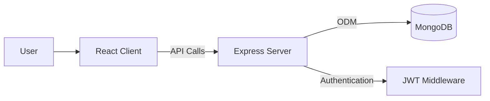

# Smart Lost & Found Network

  <b>A full-stack MERN application to connect people who lost items with those who found them</b>

  

  
  
  

---

---

## Problem Statement

Every day, many items are lost without an efficient system to reconnect owners and finders. Existing solutions are fragmented, manual, or limited in scope.

---

## Solution

The Smart Lost & Found Network provides:

- A centralized platform to report lost and found items  
- Secure authentication system  
- Scalable backend architecture  
- A foundation for future real-time communication features  

---

## Features

### Authentication and Security
- JWT-based authentication  
- Password hashing using bcrypt  
- Protected API routes  

### Backend
- RESTful API architecture  
- Input validation and error handling  
- MongoDB integration using Mongoose  

### Frontend
- Responsive UI built with React and Vite  
- Client-side routing using React Router  
- API communication using Axios  

---

## Tech Stack

### Frontend

  

### Backend

  

### Tools

  

---

## System Architecture

---

## Project Structure

Smart_Lost_&_Found_Network/

├── server/  
│   ├── config/  
│   ├── models/  
│   ├── controllers/  
│   ├── routes/  
│   ├── middleware/  
│   └── server.js  

├── client/  
│   ├── src/  
│   │   ├── pages/  
│   │   ├── components/  
│   │   ├── services/  
│   │   ├── App.jsx  
│   │   └── main.jsx  
│   └── index.html  

├── SETUP.md  
└── README.md  

---

## Getting Started

### Prerequisites

- Node.js (v14 or higher)  
- MongoDB (local or Atlas)  
- npm or yarn  

---

## Installation

### Clone Repository

git clone https://github.com/your-username/smart-lost-found.git  
cd smart-lost-found  

### Backend Setup

cd server  
npm install  
cp .env.example .env  
npm run dev  

### Frontend Setup

cd client  
npm install  
npm run dev  

Application runs at:  
http://localhost:5173  

---

## Environment Variables

Create a `.env` file inside the server directory:

PORT=5000  
MONGO_URI=your_mongodb_connection_string  
JWT_SECRET=your_secret_key  

---

## API Overview

Method | Endpoint | Description  
POST | /api/auth/register | Register user  
POST | /api/auth/login | Login user  
GET | /api/protected | Protected route  

For full API documentation, refer to SETUP.md.

---

## Current Status

- Authentication system implemented  
- Backend API functional  
- Basic frontend UI completed  
- MongoDB integration completed  
- Error handling and validation added  

---

## Future Enhancements

- Lost and found item listings  
- Search and filtering functionality  
- Real-time chat system  
- Notification system  
- Image uploads  
- User profiles  
- Reviews and ratings  

---

## Contributing

1. Fork the repository  
2. Create a new branch (git checkout -b feature/your-feature)  
3. Commit your changes (git commit -m 'Add feature')  
4. Push to the branch (git push origin feature/your-feature)  
5. Open a Pull Request  

---

## License

This project is licensed under the ISC License.

---

## Contact

Email: chhatrapatisahu09@gmail.com  
LinkedIn: https://www.linkedin.com/in/chhatrpati-sahu-4b803130a/  
GitHub: https://github.com/Chhatrapati-sahu-09  

---

## Note

This project is designed as a scalable full-stack system and can be extended into a production-ready platform with advanced features such as real-time communication and intelligent matching systems.
